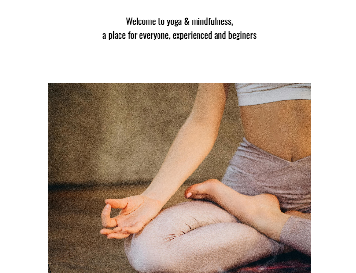

# Yoga & Mindfulness

Yoga and Mindfulness is a website for anyone that's interested in yoga, mindfulness and meditation. Everyone can sign up, it's for beginers and people with more experience. One the website you can find information about different benefites of yoga and we have four styles of yoga and meditation.

All the information you need you can find on the website, contact information and a sign up form if you want to sign up.

## Features

### Header

<ul>
<li> The header clearly shows the websites name, and has a calming background image with beige and green colors. </li> 
<li> Under the title is the navigation bar. It has working links to all the websites pages, that makes it easy for users to navigate on the website.</li>
<li> The navigation bar have a hover affect, so it's easy for users to se which page they are going to.</li>
<li> The header and navigation bar shows on all the pages of the website, to make it easy for the user to go to page they want.</li>
</ul>

### Welcome

<ul>
<li>The welcome section explains that the website is for everyone, people that have experience with yoga and for beginers</li>
</ul>

### Benefits

<ul>
<li> The benefits section explains to the user that yoga can have both meditative experiences to more physically experiences</li>
<li> It has a list that explains five different benefits yoga and meditation have one the body and mind.</li>
<li> The list of benefits have a beckground image of a women doing yoga to give the user clear and nice experience on the website.</li>
</ul>

### Contact 

<ul>
<li> The contact section encourage users to contact us if they have questions or need help. </li>
<li>The contact section provides a email address so the users can contact us.</li>
</ul>

### Footer/socialmedia

<ul>
<li> The footer have working links to social media platforms. </li>
<li> They are shown on all the pages of the website to make them accessible for the user.
</ul>

### Yoga styles

<ul>
<li>On the second page of the website the user can find ur four different yoga classes.</li>
<li> The page has a heading that tells the user that this is the yoga classes</li>
<li>The classes are displayd with an image, the name of the yoga style and a text that describes what the yoga class focuses on.</li>
</ul>

### Sign up

<ul>
<li>The sign up page has a form to collect information from the user so they can sign up to the classes</li>
<li>The form collects the users name, last name and email address </li>
<li>The sign up form gives the user a easy way to sign up for classes</li>
</ul>

## Testing

<ul>
<li> I tested so the website works on different browsers, i tested: Safari and Chrome.</li>
 
<li>I comfirmed that the links on the page works: Home, Yoga Styles and Sign up.</li>
 
<li>I tested the page using different screen sizes on the devtools device bar.</li>
 
<li>I comfirmed that the sign up form works, riquiers enteris in all felds and the submit button works.</li>
 
<li> I comfirmed that the social media links works.</li>
</ul>

## Validator Testing
<ul>
<li>index.html</li>
No errors were returned.
</ul>
<ul>
<li>yogastyles.html</li>
No errors were returned.
</ul>
<ul>
<li>signup.html</li>
No errors werde returned.
</ul>
<ul>
<li>style.css</li>
No errors were returned.
</ul>

